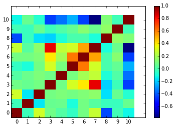
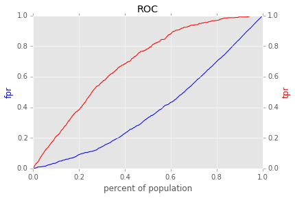

::

    ================================================
          ____  _                                 
         / __ \(_)___  ____ ____  ____  ___  _____
        / / / / / __ \/ __ `/ _ \/ __ \/ _ \/ ___/
       / /_/ / / /_/ / /_/ /  __/ / / /  __(__  ) 
      /_____/_/\____/\__, /\___/_/ /_/\___/____/  
                    /____/                        

    ================================================

------------
Introduction
------------

Diogenes is a a Python library and workflow templet for machine learning.
Principally it wraps sklearn providing enhanced functionality and simplified 
interface of often used workflows. 

-------
Example
-------

.. code:: python

    %matplotlib inline
    import diogenes
    import numpy as np
Get data from wine quality data set

.. code:: python

    data = diogenes.read.open_csv_url(
        'http://archive.ics.uci.edu/ml/machine-learning-databases/wine-quality/winequality-white.csv',
        delimiter=';')
Note that data is a `Numpy structured
array <http://docs.scipy.org/doc/numpy/user/basics.rec.html>`__ We can
use it like this:

.. code:: python

    data.dtype.names

.. parsed-literal::

    ('fixed acidity',
     'volatile acidity',
     'citric acid',
     'residual sugar',
     'chlorides',
     'free sulfur dioxide',
     'total sulfur dioxide',
     'density',
     'pH',
     'sulphates',
     'alcohol',
     'quality')

.. code:: python

    print data.shape

.. parsed-literal::

    (4898,)

.. code:: python

    print data['fixed acidity']

.. parsed-literal::

    [ 7.   6.3  8.1 ...,  6.5  5.5  6. ]

We separate our labels from the rest of the data and turn our labels
into binary classes.

.. code:: python

    labels = data['quality']
    labels = labels < np.average(labels)
    print labels

.. parsed-literal::

    [False False False ..., False False False]

Remove the labels from the rest of our data

.. code:: python

    M = diogenes.modify.remove_cols(data, 'quality')
    print M.dtype.names

.. parsed-literal::

    ('fixed acidity', 'volatile acidity', 'citric acid', 'residual sugar', 'chlorides', 'free sulfur dioxide', 'total sulfur dioxide', 'density', 'pH', 'sulphates', 'alcohol')

Print summary statistics for our features

.. code:: python

    diogenes.display.pprint_sa(diogenes.display.describe_cols(M))

.. parsed-literal::

                Column Name Count            Mean     Standard Dev Minimum Maximum
     0        fixed acidity  4898   6.85478766844   0.843782079126     3.8    14.2
     1     volatile acidity  4898  0.278241118824   0.100784258542    0.08     1.1
     2          citric acid  4898  0.334191506737    0.12100744957     0.0    1.66
     3       residual sugar  4898   6.39141486321    5.07153998933     0.6    65.8
     4            chlorides  4898 0.0457723560637  0.0218457376851   0.009   0.346
     5  free sulfur dioxide  4898   35.3080849326    17.0054011058     2.0   289.0
     6 total sulfur dioxide  4898   138.360657411    42.4937260248     9.0   440.0
     7              density  4898   0.99402737648 0.00299060158215 0.98711 1.03898
     8                   pH  4898   3.18826663944   0.150985184312    2.72    3.82
     9            sulphates  4898  0.489846876276   0.114114183106    0.22    1.08
    10              alcohol  4898   10.5142670478    1.23049493654     8.0    14.2

Plot correlation between features

.. code:: python

    fig = diogenes.display.plot_correlation_matrix(M)

Arrange an experiment trying different classifiers

.. code:: python

    exp = diogenes.grid_search.experiment.Experiment(
        M,
        labels,
        clfs=diogenes.grid_search.standard_clfs.std_clfs)
Make a pdf report

.. code:: python

    exp.make_report(verbose=False)

.. parsed-literal::

    /Library/Python/2.7/site-packages/sklearn/svm/base.py:204: ConvergenceWarning: Solver terminated early (max_iter=1000).  Consider pre-processing your data with StandardScaler or MinMaxScaler.
      % self.max_iter, ConvergenceWarning)
    /Library/Python/2.7/site-packages/sklearn/svm/base.py:204: ConvergenceWarning: Solver terminated early (max_iter=1000).  Consider pre-processing your data with StandardScaler or MinMaxScaler.
      % self.max_iter, ConvergenceWarning)

.. parsed-literal::

    '/Users/zar1/dssg/diogenes/report.pdf'

Find the trial with the best score and make an ROC curve

.. code:: python

    trials_with_score = exp.average_score()
    best_trial, best_score = max(trials_with_score.iteritems(), key=lambda trial_and_score: trial_and_score[1])
    print best_trial
    print best_score

.. parsed-literal::

    Trial(clf=<class 'sklearn.ensemble.forest.RandomForestClassifier'>, clf_params={'n_estimators': 50, 'max_features': 'sqrt', 'n_jobs': 1, 'max_depth': 7}, subset=<class 'diogenes.grid_search.subset.SubsetNoSubset'>, subset_params={}, cv=<class 'sklearn.cross_validation.KFold'>, cv_params={})
    0.756236767007

.. code:: python

    fig = best_trial.roc_curve()

------------
Installation
------------

`pip install git+git://github.com/dssg/diogenes.git`

Required Packages
=================

Python packages
---------------
- `Python 2.7 <https://www.python.org/>`_
- `Numpy 1.10.1 <http://www.numpy.org/>`_
- `scikit-learn <http://scikit-learn.org/stable/>`_
- `pandas <http://pandas.pydata.org/>`_
- `SQLAlchemy <http://www.sqlalchemy.org/>`_
- `pdfkit <https://github.com/pdfkit/pdfkit>`_
- `plotlib <http://matplotlib.org/>`_

Other packages
--------------

- `wkhtmltopdf <http://wkhtmltopdf.org/>`_

-------
Example
-------
::

    import diogenes
    import numpy as np
    # Get data from Wine Quality data set
    data = diogenes.read.open_csv_url(
        'http://archive.ics.uci.edu/ml/machine-learning-databases/wine-quality/winequality-white.csv',
        delimiter=';')
    # Take labels from the quality column
    labels = data['quality']
    # Make this a binary classification problem
    labels = labels < np.average(labels)
    # Remove labels from data to make feature set
    M = diogenes.modify.remove_cols(data, 'quality')
    # Print statistics of features
    diogenes.display.pprint_sa(diogenes.display.describe_cols(M))
    # Plot correlation between features
    diogenes.display.plot_correlation_matrix(M)
    # Set up grid search experiment using different classifiers
    exp = diogenes.grid_search.experiment.Experiment(
        M, 
        labels, 
        clfs=diogenes.grid_search.standard_clfs.std_clfs)
    # Make a report for the experiment to find best-performing classifiers
    exp.make_report()

----------
Next Steps
----------

Check out the `documentation <http://dssg.github.io/diogenes>`_

----
Misc
----
my_* are included in the .gitignore.  We recommend a standard such as my_experiment, my_storage for local folders.

